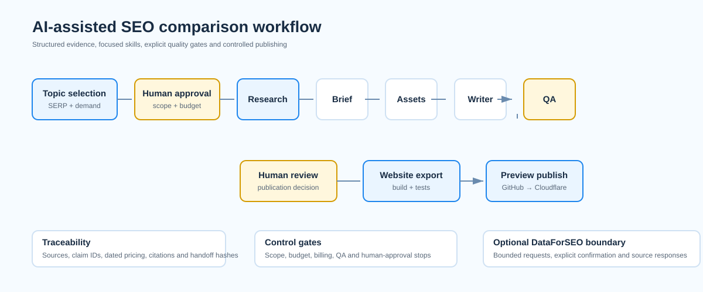

# AI-assisted SEO comparison workflow

Prototype workflow for researching, producing, evaluating and publishing SEO comparison pages with structured evidence, focused workflow steps and explicit quality gates.

**Live preview:** [Seobility comparisons](https://seobility-comparisons-site.pages.dev/) · [Tool-fit selector](https://seobility-comparisons-site.pages.dev/quiz/)

> The preview is publicly reachable but marked `noindex`; it is a prototype preview, not production software or an official product site.



## The problem

Comparison content can be quick to produce but difficult to trust. This prototype treats research, writing and publishing as separate, inspectable steps. It keeps source evidence and reader-facing citations distinct, uses a formal QA gate before publication, and stops rather than silently progressing when a quality or billing control fails.

## Workflow

1. **Topic selection** ranks eligible comparison topics from structured inputs and inspected SERP evidence. DataForSEO collection is optional, budget-bounded and requires explicit confirmation.
2. **Research** produces structured claims, SERP analysis and source notes.
3. **Brief** turns supported evidence into a search-intent-aware editorial plan.
4. **Assets** collects relevant, attributable visual evidence or records an approved fallback.
5. **Writer** produces the traceable draft.
6. **QA** checks accuracy, citations, comparative usefulness, specificity, originality and positioning.
7. **Human publication review** remains a required boundary.
8. **Website export** strips internal claim annotations, builds the static site, runs tests and publishes only after approval.

The orchestrator coordinates these steps; it is intentionally not a background content-generation daemon. It persists state, validates handoffs, tracks bounded API costs and requires explicit approvals at decision points.

## What is included

- Seven focused workflow skills, including selection and orchestration
- A small Python implementation of selection, state, validation, handoffs and the DataForSEO boundary
- JSON schemas, policy configuration and synthetic fixtures
- Unit tests covering input validation, selection logic, failure handling, staged handoffs and budget controls
- A linked static demo website with three comparison pages and a transparent browser-only fit selector

## Quality and control evidence

- Traceable claim identifiers remain in working drafts and do not leak into the published website.
- Current pricing, plan limits and sensitive claims require visible, dated source treatment.
- Handoffs record reviewed outputs and content hashes.
- The runner blocks unresolved billing, out-of-scope production and failed QA handoffs.
- Publishing keeps the preview `noindex` and separates research files from the website export.
- The browser-only selector stores no answers and makes no external AI or API call.

## Run locally

This prototype uses Python 3.11+ for the workflow and standard-library unit tests.

```bash
python3 -m unittest discover -s tests -q
python3 scripts/orchestrate.py --help
python3 skills/comparison-topic-selection/scripts/select_topics.py --help
```

No credentials are required for tests or synthetic samples. Real DataForSEO collection requires locally supplied environment variables and explicit cost confirmation; see `.env.example` and `docs/RESEARCH_POLICY.md`.

## Project map

| Path | Purpose |
| --- | --- |
| `skills/` | Instructions for each focused workflow step |
| `src/seobility_workflow/` | Selection, state, validation, handoff and collection logic |
| `schemas/` | JSON contracts for run artifacts and review outputs |
| `tests/` | Automated tests and synthetic fixtures |
| `samples/` | Non-production sample inputs and outputs |
| `docs/` | Architecture, policies, operating boundaries and limitations |

## Prototype limitations

This is a constrained prototype. It does not replace human editorial review, legal review of third-party assets, real-world product testing or a production publishing system. Pricing and plan limits must be rechecked before publication. The topic selector ranks only the evidence it is given; it does not claim exhaustive market coverage or ranking outcomes. See [limitations](docs/limitations.md) for production considerations.

## Demo guide

For a 5–10 minute review, start with [the architecture](docs/architecture.md), then scan a skill definition, its corresponding test coverage and the live preview. [The demo guide](docs/demo-guide.md) suggests a short path through the repository.
