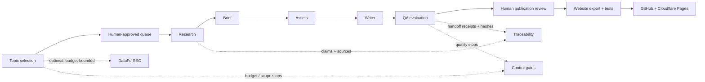

# Architecture at a glance

The design separates editorial work from control logic. The seven skills define their responsibilities and output expectations. The lightweight orchestrator persists state, validates handoffs and enforces approvals; it does not make editorial decisions or run unattended.

The optional DataForSEO boundary is deliberately narrow: request plans are checked against scope and budget before a live request, responses are retained for traceability, and collection stops if billing is unresolved.
